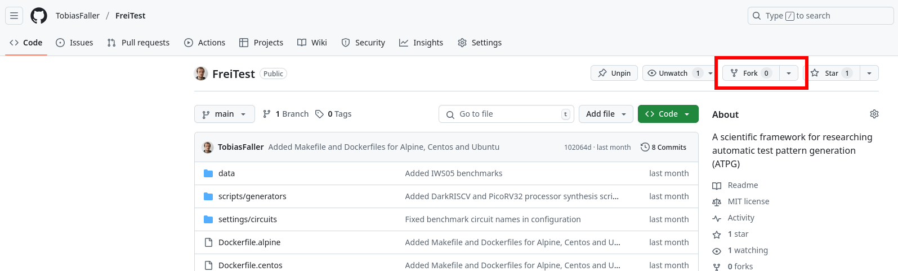

[Index](../../../README.md) -  [Next Topic](./IdeSetup.md)

# Git Setup

To create a writeable repository of this framework open [github.com/TobiasFaller/freitest](https://github.com/TobiasFaller/freitest) and select click on the **Fork** button.
Select your account as target and wait for the fork to be created.



## Clone the repository

> An SSH key to push / pull might be required.
> To create a new SSH key on your computer use the `ssh-keygen -t rsa -b 4096 -N '' -f ~/.ssh/id_rsa` command.
> Copy the public key from at `~/.ssh/id_rsa.pub` and add it to your GitHub account under under **Settings -> SSH and GPG keys**.

To create a local repository of the github repository, click on the green **Code** button on the right of your fork.
Copy the URL via the copy button on the right.
Then clone the repository to your computer via the following command (replace the URL parameter with your URL):

```bash
git clone URL freitest
git --git-dir=freitest/.git remote add upstream https://github.com/TobiasFaller/FreiTest.git
```

## Fetch changes from upstream

To receive updates from the upstream repository fetch and rebase via the following commands.

```bash
# Download the upstream version
git fetch --all

# Save current work, then rebase onto the new version and restore the current work
git stash --all
git rebase upstream/main
git stash pop
```

## Committing your changes

Use the `git status` command to see the current status of your working directory and the contained files.
The `git log` command shows the history of all commits.
When a commit in the log is annotated with a branch name, then the local or remote branch is currently at that revision.
Use the `git log --oneline --decorate --graph` command to get a more verbose, tree-like view of the commit history.
Use `git fetch --all` to receive updates of the upstream repository in your log.

To save your work in Git create a _commit_ via the `git commit` command.
A commit is a set of related changes to the files under version control.
Use the `git add` command to add files to the set of changes.
Then follow up with `git commit -m "MESSAGE"` to finalize the commit.
To fix a typo in the last commit's message use the `git commit --amend` command.
Push the changes to the repository via the `git push origin` command.
See below for an example:

```bash
git add path/file
git commit -m "Added some new files"
git push origin main
```

[Previous Topic](./WslSetup.md) - [Index](../../../README.md) -  [Next Topic](./IdeSetup.md)
