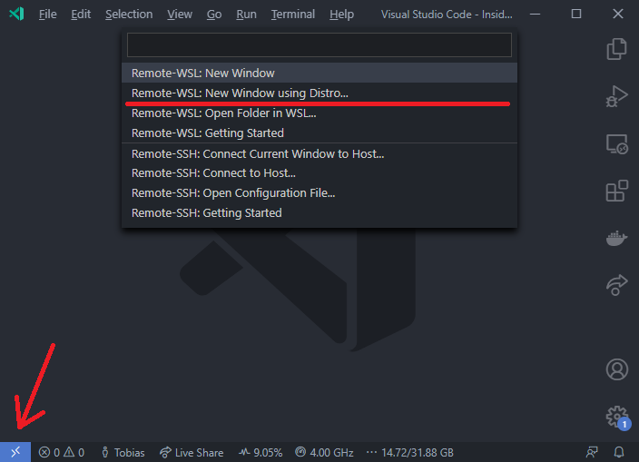

[Previous Topic](1_GitSetup.md) - [Index](../../../README.md) -  [Next Topic](3_BuildSetup.md)

# Setup Visual Studio Code

Download Visual Studio Code (VS Code) from [https://code.visualstudio.com/](https://code.visualstudio.com/).

Now open the **freitest.code-workspace** file located inside the project directory via `File -> Open workspace`.
You can now install the optional plugins which are recommended by the workspace in the `Workspace Recommendations` category if asked.
If your are not asked by Visual Studio Code then type **@recommended** into the plugin serach box in the **Plugins** tab and look out for the `Workspace Recommendations` category.

## Open inside WSL

Install the **Remote Development** plugin via the plugin manager.
Click on the button on the bottom left or use the command palette, then select **Remote-WSL: New Window** or **Remote-WSL: New Window using Distro ...** from the menu.
This will now open WSL in your WSL distribution while showing the user interface on Windows.

## Open inside Development Container

Install docker for your platform (for docker in WSL 2 install the Docker Desktop distribution for Windows and enable the WSL 2 integration).
Then click on the bottom left of the window or open the command palette, then select the option **Remote-Containers: Reopen in Container**.
The initial setup builds the docker container which is currently based on Ubuntu and installs all required dependencies.
The configuration for the development container is located under _.devcontainer/devcontainer.json_.
The Dockerfile for the development container is located under _Dockerfile.ubuntu_.

# Run and Debug FreiTest

Run the currently selected configuration by pressing F5.
The active configuration can be selecting from the debug menu.
The launch configuration is contained in _.vscode/launch.json_, while the build configuration is contained in _.vscode/tasks.json_.
The program output is written to the **Terminal** tab in Visual Studio Code.
Make sure to select the correct terminal in the drop-down menu on the right side to see the program output.

When hitting a breakpoint a debug view similar to below is shown.
The current run line of the program is highlighed and the corresponding variables are shown on the top-right view.
On the bottom-right view the call-stack of the current and the other threads is shown.

Continue the execution by pressing F5.
Use F10 to execute the next instruction.
Use F11 to jump into the next method, Ctrl+F11 (or Strg+F11) to jump out of the method.

[Previous Topic](1_GitSetup.md) - [Index](../../../README.md) -  [Next Topic](3_BuildSetup.md)
