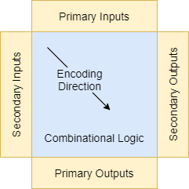
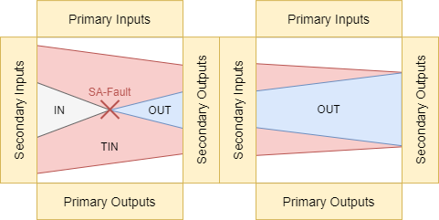
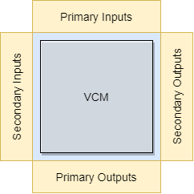

[Previous Topic](3_LogicEncoding.md) - [Index](../../../README.md) - [Next Topic](5_CircuitSimulator.md)

# Logic Generator

The logic generator comprises of multiple modules that transform the source circuit into a SAT-formula.
By exchanging the encoding / tagging modules, different test scenarios with varying test constraints can be constructed.
The encoding is done in two steps:

1. First the circuit nodes are tagged that will later be encoded
2. Then the circuit is encoded in order of the topological sorting (ascending node ID)



Usage of the logic generator comprises of adding modules via the EmplaceModule method, and subsequently calling GenerateCircuitLogic to start the encoding process.
The logic generator handles ciruit iteration and calling each module in order of instantiation.
The modules each generate literals and clauses that are added to the solver instance.
The generator modules can cancel the encoding process in case continuation of encoding is unreasonable (e.g. when the faulty gate is not connected to any observable primary / secondary output).
The number of encoded target timeframes is configured via calling SetNumberOfTimeframes on the generator's context.

```cpp
using namespace SolverProxy;

using LogicContainer = Tpg::LogicContainer01;
using PinData = Tpg::PinDataGB<LogicContainer>;

auto logicGenerator { Tpg::LogicGenerator<PinData>(solver, circuit) };
logicGenerator.EmplaceModule<...<PinData>>(...);

logicGenerator.GetContext().SetNumberOfTimeframes(1u);
if (!logicGenerator.GenerateCircuitLogic())
{
	Logging::Panic("A module aborted the encoding process");
}

LOG(INFO) << "Successfully generated circuit and solving for solution";
switch(solver->Solve())
{
    case Sat::SatResult::SAT:
    case Sat::SatResult::UNSAT:
    case Sat::SatResult::TIMEOUT:
        // Do something with the result
        break;
}
```

The user can manually encode constraints on top of the problem by using the generator context instance.
For convenience the logic encoder of the context provides encoding for basic logic gates and constraints.

```cpp
...
logicGenerator.GetContext().SetNumberOfTimeframes(1u);
if (!logicGenerator.GenerateCircuitLogic())
{
	Logging::Panic("A module aborted the encoding process");
}

// Manual encoding in same SAT / BMC instance
auto& context { logicGenerator.GetContext() };
auto& port { circuit->GetMetaData().GetPort("myadder/g1/A") };
auto& driver { port.GetConnectionForIndex(0u).GetMappedSources()[0u] };
auto& container { context.GetTimeframe(0).GetContainer(context, driver.node.GetNodeId(),
    driver.port.portType, driver.port.portNumber) };

context.GetEncoder().EncodeLogicValueConstraint(Basic::LogicConstraint::NOT_LOGIC_ZERO);

LOG(INFO) << "Successfully generated circuit and solving for solution";
switch(solver->Solve())
...
```

## Encoding / Tagging Modules

1. **Circuit Tagging**: Choosing the circuit parts that are relevant for encoding. \
    These modules are responsible for the tagging of circuit nodes:
    - **WholeCircuitTagger**: Tagging all nodes with tags
    - **FanInCircuitTagger**: Tagging the fan-in of nodes with tags
    - **FanOutCircuitTagger**: Tagging the fan-out of nodes with tags
    - **StuckAtFaultCircuitTagger**: Tagging the stuck-at fault relevant nodes
    - **TransitionDelayFaultCircuitTagger**: Tagging the transition-delay fault relevant nodes
    - **CellAwareFaultCircuitTagger**: Tagging the cell-aware fault relevant nodes

    To encode all nodes of the circuit use the WholeCircuitTagger.

    When a fault tagger is used it will be responsible for the tagging.
    Nodes which are in the fanin (IN) of the fault location are tagged with GoodTag.
    Nodes which are in the fanout (OUT) of the fault location are tagged with GoodTag and BadTag.
    Nodes which are in the transitive fanin (TIN) of the secondary outputs are required to reason the logic value of the output and are encoded with GoodTag.
    (Note, in the figure we omitted the second stuck-at fault to keep the figure understandable.)

    

2. **Fault Encoding**: Applying a fault model to the circuit encoding. \
    The fault encoders are responsible for exchanging the logic literals with the faulty versions at the fault location.
    It acts as a proxy in the circuit generation process which is used when calling the `GetContainer` method that should be used when accessing the logic inputs or outputs of an encoded gate.
    The fault generator is supplied with the fault model which holds the faults that should be injected.

    - **StuckAtFaultEncoder** using the SingleStuckAtFaultModel or MultiStuckAtFaultModel: Encodes stuck-at fault models
    - **TransitionDelayFaultEncoder** using the TransitionDelayFaultModel: Encodes gross transition delay fault models
    - **CellAwareFaultEncoder** using the CellAwareFaultModel: Encodes cell-aware fault models

    The fault sensitization and propagation modules are responsible for applying sensitization (fault is activated) and propagation (fault is propagated) requirements.

    - **StuckAtSensitizationConstraintEncoder**: Encodes requirement at fault location that GoodTag has sensitizing logic value
    - **TransitionDelaySensitizationConstraintEncoder**: Encodes requirement at fault location that GoodTag has sensitizing logic value
    - **CellAwareSensitizationConstraintEncoder**: Encodes requirement at fault location that GoodTag has sensitizing logic value
    - **FaultPropagationRequirementGenerator**: Encodes requirement that the fault is propagated to selected outputs

3. **Logic Encoding**: Encode the combinational and sequential functionality of the circuit. \
    Multiple logic encoders are responsible for encoding the circuit logic:

    - **DefaultLogicEncoder**: Combinational logic encoding
    - **InputLogicEncoder**: Encodes primary inputs to the circuit
    - **OutputLogicEncoder**: Encodes primary outputs to the circuit
    - **SequentialInputLogicEncoder**: Encodes secondary inputs (sequential elements)
    - **SequentialOutputLogicEncoder**: Encodes secondary outputs (sequential elements)
    - **SequentialConnectionEncoder**: Connects secondary inputs and outputs (sequential elements) between timeframes

    The **DefaultLogicEncoder** handles encoding of all gates which are not inputs / outputs or sequential gates.
    When requiring the encoding of GoodTag and BadTag, this logic encoder has to be added twice with both tags.

    The **InputLogicEncoder** and **OutputLogicEncoder** handle the encoding of the primary circuit inputs and outputs.
    For inputs new literals are created and assigned, while no constraints are imposed.
    The outputs are encoded similar to a buffer gate.
    By changing how output ports are handled tri-state outputs or similar features could be implemented.

    The **SequentialInputLogicEncoder** and **SequentialOutputLogicEncoder** encode secondary inputs and outputs (sequential elements).
    Secondary inputs are encoded by creating a new unconstrainted input literal, like a circuit input.
    The encoding of the secondary output depends on the configuration given.
    It can range from encoding as a buffer, ignoring clock signals, set and reset inputs, to handling set and reset inputs.
    The **SequentialConnectionEncoder** encodes the sequential behavior of the sequential elements by connecting secondary outputs to the secondary inputs of the next timeframe.

4. **Basic Constraint Encoding**: Applying constraints to inputs / outputs and sequential elements. \
    Encode additional constraints, like the allowed set of initial states of sequential elements or the allowed logic values for circuit inputs.
    Use the DiffTag to constrain the fault difference between the GoodTag and BadTag version (e.g. LOGIC_ONE to force a fault difference).
    Use the LDiffTag to constrain the logic difference between the GoodTag and BadTag version (e.g. LOGIC_ZERO to make logic values equal).

    - **PortConstraintEncoder**: Constraints primary inputs and outputs of the circuit
    - **SequentialConstraintEncoder**: Constraints secondary inputs and outputs (sequential elements) of the circuit
    - **PatternExclusionConstraintEncoder**: Constraints primary and secondary inputs to differ from the given test patterns

5. **Validity Checker Module (VCM) Encoding**: Applying complex constraints specificied in a so-called Validity Checker Module (VCM) circuit. \
    Encode the input and output ports of the Validity Checker Module (VCM), that require special handling to connect them to the target circuit and apply VCM constraints.

    - **VcmInputLogicEncoder**: Encodes the primary inputs of the VCM, connecting them to the target circuit
    - **VcmOutputLogicEncoder**: Encodes the primary outputs of the VCM, applying the constraints encoded inside the VCM
  
    The VCM is used to enforce the generation of a valid test patterns for the targeted use-case by applying complex constraints.
    This is required for functional test pattern generation as in Software Test Library (STL) and Software-Based Self-Test (SBST) generation.

    The VCM input ports can have multiple functions that are determined by the suffix of the port.
    The suffixes _g, _b, _d, _gv, _bv specify an encoding and wire or port name of the target (miter) circuit that this VCM port should be connected to.
    The wire or port of the target circuit is determined through name-matching (e.g. \mymodule/sub1/A_g targets port mymodule/sub1/A in GoodTag encoding).
    If an encoding of the target circuit is not available (e.g. DiffTag for PinDataGB) in most cases it will be emulated.
    A suffix of _parameter reads the parameter from the VCM context (e.g. [15:0] \cycles_param reads the 16 bits of the cycles parameter).
    A suffix of _const0, _const1, _constx, _constu reads a constant input value of LOGIC_ZERO, LOGIC_ONE, LOGIC_DONT_CARE or LOGIC_UNKNOWN.
    A suffix of _sfree, _dfree provides unconstrained input literals that are either constant over all timeframes or separate for each timeframe respectively.
    A suffix of _init, _bcntr, _ucntr, _tf reads a counter that either counts down from 1 to 0 and stays 0, counts up from 0 in binary, counts up from 0 in unary, counts up from 1 via a one-hot encoding.

    - *_g: The GoodTag encoding of the target circuit is read
    - *_b: The BadTag encoding of the target circuit is read
    - *_d: The DiffTag (fault difference) encoding of the target circuit is read
    - *_gv: Reads if the GoodTag encoding has a valid value of LOGIC_ZERO or LOGIC_ONE, and not anything undetermined like LOGIC_DONT_CARE and not LOGIC_UNKNOWN
    - *_bv: Reads if the BadTag encoding has a valid value of LOGIC_ZERO or LOGIC_ONE, and not anything undetermined like LOGIC_DONT_CARE and not LOGIC_UNKNOWN
    - *_param: Reads a parameter from the VCM context encoded in binray logic
    - *_const0: Reads a constant LOGIC_ZERO
    - *_const1: Reads a constant LOGIC_ONE
    - *_constx: Reads a constant LOGIC_DONT_CARE
    - *_constu: Reads a constant LOGIC_UNKNOWN
    - *_sfree: Reads a solver-defined logic value that is constant in every timeframe
    - *_dfree: Reads a solver-defined logic value that changes every timeframe
    - *_init: Reads a counter that is only LOGIC_ONE on the first timeframe
    - *_bcntr: Reads a binary counter that counts from 0 (requires BinaryCounterEncoder module)
    - *_ucntr: Reads a unary counter that counts from 0 (requires UnaryCounterEncoder module)
    - *_tf: Reads a counter that is a one-hot encoding representing the current timeframe
  
    The VCM output ports can have multiple functions that are determined by the suffix of the port.
    The suffixes _i, _c, _t encode initial, transition and target constraints respectively.
    The suffixe _result encodes an output that can be extracted later to retrieve processed data from the VCM in a workflow.

    - *_i: Encodes a constraint that is enforced exactly in the first timeframe
    - *_c: Encodes a constraint that is enforced in every timeframe
    - *_t: Encodes a constraint that is enforced to be reached eventually
    - *_result: Encodes an output that later can be extracted from the solver's solution
 
    Typically, the VCM is encoded together with the (miter) circuit via a second LogicGenerator instance and GeneratorContext.
    It can be though of sitting "on top" of the target (miter) circuit, accessing and constraining the ports of the target circuit as depicted in the figure below.

    

6. **Counter Encoder**: Encoding binary and unary counters. \
    Encode the counter into the GeneratorContext where they can be for example used by other modules.

    - **BinaryCounterEncoder**:  Encodes a binary counter that counts up to the maximum timeframes
    - **UnaryCounterEncoder**: Encodes a unary counter that counts up to the maximum timeframes

7. **D-Chain Generator** \
    Encodes a difference chain for the circuit nodes.
    The difference chain enables a speedup (up to a factor of 10) for the SAT / BMC-problem in cases where the sequential depth is high and  the fault fan-in or fan-out is high.
    This chain encodes constraints that force the solver to apply a fault difference to at least one of the input ports of a gate if the  output port shows a fault difference.
    This requires the difference DiffTag to present which can be tagged by the `DChainCircuitTagger` which encodes all nodes with  DiffTag that have a good (GoodTag) and bad (BadTag) encoding.
    The `DChainBaseEncoder` encodes the difference literals following the tagging by encoding XOR-like gates that show a difference for the good and bad encoding value.
    The chain itself is then built by the `BackwardDChainEncoder` and `BackwardDChainConnectionEncoder` that connect the difference literals in a chain-like structure.

    - **DChainCircuitTagger**: TODO
    - **DChainBaseEncoder**: TODO
    - **ForwardDChainEncoder**: TODO
    - **ForwardDChainConnectionEncoder**: TODO
    - **BackwardDChainEncoder**: TODO
    - **BackwardDChainConnectionEncoder**: TODO

# Fault Model Modules

## Single / Multiple Stuck-At Fault Model

This single stuck-at fault model supports exactly one permanent stuck-at fault at a time,
while the multiple stuck-at fault model supports multiple permanent stuck-at faults at the same time.

The stuck-at fault models use the `StuckAtFaultCircuitTagger` for tagging, while the encoding of the fault is done by the `StuckAtFaultEncoder` module.

```cpp
auto sa0Fault = std::make_shared<Fault::SingleStuckAtFault>(
    { nodeId, { Fault::SingleStuckAtFaultPinType::INPUT_PIN, inputPin } },
    Fault::StuckAtFaultType::STUCK_AT_0
);
auto faultModel = std::make_shared<Fault::SingleStuckAtFaultModel>(sa0Fault);

auto logicGenerator { Tpg::LogicGenerator<PinData>(solver, circuit) };
logicGenerator.EmplaceModule<Tpg::StuckAtFaultCircuitTagger<PinData, Fault::SingleStuckAtFaultModel>>(faultModel);
logicGenerator.EmplaceModule<Tpg::StuckAtFaultEncoder<PinData, Fault::SingleStuckAtFaultModel>>(faultModel);
logicGenerator.EmplaceModule<...>(...); // Other modules
logicGenerator.EmplaceModule<Tpg::StuckAtSensitizationConstraintEncoder<PinData, Fault::SingleStuckAtFaultModel>>(faultModel);
logicGenerator.EmplaceModule<Tpg::FaultPropagationConstraintEncoder<PinData>>(Tpg::FaultPropagationTarget::PrimaryOutputsOnly);

// -----------------------------------------------

auto saFaults = std::make_shared<Fault::MultiStuckAtFault>(
    {
        { inputNodeId, { Fault::SingleStuckAtFaultPinType::INPUT_PIN, inputPin } },
        Fault::StuckAtFaultType::STUCK_AT_0
    },
    {
        { outputNodeId, { Fault::SingleStuckAtFaultPinType::OUTPUT_PIN, outputPin } },
        Fault::StuckAtFaultType::STUCK_AT_1
    }
);
auto faultModel = std::make_shared<Fault::MultiStuckAtFaultModel>(saFaults);

auto logicGenerator { Tpg::LogicGenerator<PinData>(solver, circuit) };
logicGenerator.EmplaceModule<Tpg::StuckAtFaultCircuitTagger<PinData, Fault::MultiStuckAtFaultModel>>(faultModel);
logicGenerator.EmplaceModule<Tpg::StuckAtFaultEncoder<PinData, Fault::MultiStuckAtFaultModel>>(faultModel);
logicGenerator.EmplaceModule<...>(...); // Other modules
logicGenerator.EmplaceModule<Tpg::StuckAtSensitizationConstraintEncoder<PinData, Fault::MultiStuckAtFaultModel>>(faultModel);
logicGenerator.EmplaceModule<Tpg::FaultPropagationConstraintEncoder<PinData>>(Tpg::FaultPropagationTarget::PrimaryOutputsOnly);
```

## Single / Multiple Transition-Delay Fault Model

This single transition-delay fault model supports exactly one gross transition-delay fault at a time,
while the multiple transition-delay fault model supports multiple gross transition-delay faults at the same time.

The transition-delay fault models use the `TransitionDelayFaultCircuitTagger` for tagging, while the encoding of the fault is done by the `TransitionDelayFaultEncoder` module.

```cpp
auto sa0Fault = std::make_shared<Fault::SingleTransitionDelayFault>(
    { nodeId, { Fault::SingleTransitionDelayFaultPinType::INPUT_PIN, inputPin } },
    Fault::TransitionDelayFaultType::SLOW_TO_RISE
);
auto faultModel = std::make_shared<Fault::SingleTransitionDelayFaultModel>(sa0Fault);

auto logicGenerator { Tpg::LogicGenerator<PinData>(solver, circuit) };
logicGenerator.EmplaceModule<Tpg::TransitionDelayFaultCircuitTagger<PinData, Fault::SingleTransitionDelayFaultModel>>(faultModel);
logicGenerator.EmplaceModule<Tpg::TransitionDelayFaultEncoder<PinData, Fault::SingleTransitionDelayFaultModel>>(faultModel);
logicGenerator.EmplaceModule<...>(...); // Other modules
logicGenerator.EmplaceModule<Tpg::TransitionSensitizationConstraintEncoder<PinData, Fault::SingleTransitionDelayFaultModel>>(faultModel);
logicGenerator.EmplaceModule<Tpg::FaultPropagationConstraintEncoder<PinData>>(Tpg::FaultPropagationTarget::PrimaryOutputsOnly);

// -----------------------------------------------

auto saFaults = std::make_shared<Fault::MultiTransitionDelayFault>(
    {
        { inputNodeId, { Fault::SingleTransitionDelayFaultPinType::INPUT_PIN, inputPin } },
        Fault::TransitionDelayFaultType::SLOW_TO_RISE
    },
    {
        { outputNodeId, { Fault::SingleTransitionDelayFaultPinType::OUTPUT_PIN, outputPin } },
        Fault::TransitionDelayFaultType::SLOW_TO_FALL
    }
);
auto faultModel = std::make_shared<Fault::MultiTransitionDelayFaultModel>(saFaults);

auto logicGenerator { Tpg::LogicGenerator<PinData>(solver, circuit) };
logicGenerator.EmplaceModule<Tpg::TransitionDelayFaultCircuitTagger<PinData, Fault::MultiTransitionDelayFaultModel>>(faultModel);
logicGenerator.EmplaceModule<Tpg::TransitionDelayFaultEncoder<PinData, Fault::MultiTransitionDelayFaultModel>>(faultModel);
logicGenerator.EmplaceModule<...>(...); // Other modules
logicGenerator.EmplaceModule<Tpg::TransitionSensitizationConstraintEncoder<PinData, Fault::MultiTransitionDelayFaultModel>>(faultModel);
logicGenerator.EmplaceModule<Tpg::FaultPropagationConstraintEncoder<PinData>>(Tpg::FaultPropagationTarget::PrimaryOutputsOnly);
```

## Cell-Aware Fault Model

The Cell-Aware fault model is constructed from a single fault of a User-Defined Fault Model (UDFM).
The fault model targets one instance of a specific cell type in the target circuit (e.g. AND-cell at location mymultiplier/chain1) and a single fault (e.g. bridge fault between port A and B).
The UDFRM contains a description of one or more test alternatives that can be applied to the target cell to test for the presence of the fault.
Each test alternative has conditions that are required to be applied, and effects that model the behaviour of the cells output under the application of the specificed conditions.
Typically, the UDFM is stored in an external resource file that is loaded from storage and encodes the UDFM for a single cell library and use case.
For more information on cell-aware testing see the publications below:

Hapke, F. & Krenz-Baath, R. & Glowatz, Andreas & Schlöffel, Jürgen & Hashempour, Hamidreza & Eichenberger, S. & Hora, C. & Adolfsson, D.. (2009). Defect-oriented cell-aware ATPG and fault simulation for industrial cell libraries and designs. Proceedings - International Test Conference. 1 - 10. 10.1109/TEST.2009.5355741.

The tagging is conducted by the `CellAwareFaultCircuitTagger`, while the encoding of the fault is done by the `CellAwareFaultEncoder` module.

```cpp
auto udfmFault = std::make_shared<UserDefinedFault>(
    "AND", "A_B_brigde_fault_50ohm", "bridge_fault");
userDefienedFault->AddAlternative(
    "static_test",
    {
        { "A", { Logic::LOGIC_ONE } },
        { "B", { Logic::LOGIC_ZERO } }
    },
    {
        { "OUT", { Logic::LOGIC_ZERO } }
    }
);
userDefienedFault->AddAlternative(
    "static_test",
    {
        { "A", { Logic::LOGIC_ZERO } },
        { "B", { Logic::LOGIC_ONE } }
    },
    {
        { "OUT", { Logic::LOGIC_ZERO } }
    }
);

auto cell = circuit->GetMetaData().GetGroup("mymultiplier/chain1");
auto cellAwareFault = Fault::MapUdfmFaultToCell(circuit, cell, udfmFault);
auto faultModel = std::make_shared<Fault::CellAwareFaultModel>(cellAwareFault);

auto logicGenerator { Tpg::LogicGenerator<PinData>(solver, circuit) };
logicGenerator.EmplaceModule<Tpg::CellAwareFaultCircuitTagger<PinData>>(faultModel);
logicGenerator.EmplaceModule<Tpg::CellAwareFaultEncoder<PinData>>(faultModel);
logicGenerator.EmplaceModule<...>(...); // Other modules
logicGenerator.EmplaceModule<Tpg::CellawareSensitizationConstraintEncoder<PinData>>(faultModel);
logicGenerator.EmplaceModule<Tpg::FaultPropagationConstraintEncoder<PinData>>(Tpg::FaultPropagationTarget::PrimaryOutputsOnly);
```

## Fault Propagation

The target for the fault effect propagation can be specified by using one of the following options:

- **PrimaryOutputsOnly**: Encode the difference for all primary outputs
- **SecondaryOutputsOnly**: Encode the difference for all secondary outputs
- **PrimaryAndSecondaryOutputs**: Encode the difference for all primary and secondary outputs

# Combinational Encoding Modules

The `DefaultLogicEncoder` encodes the combinational gates that have one of the following types:

- **MAIN_CONSTANT**: Constant output gate without inputs
- **MAIN_BUF**: Buffer gate with one input
- **MAIN_INV**: Inverter gate with one input
- **MAIN_XOR**: XOR gate with one to four inputs
- **MAIN_AND**: AND gate with one to four inputs
- **MAIN_OR**: OR gate with one to four inputs
- **MAIN_XNOR**: XNOR gate with one to four inputs
- **MAIN_NAND**: NAND gate with one to four inputs
- **MAIN_NOR**: NOR gate with one to four inputs

# Sequential Encoding Modules

The `SequentialOutputLogicEncoder` allows specifying the sequential model and set-reset port handling for encoding.
Currently not all sequential types are supported.

The sequential model specifies how the sequential gates are encoded as follows:

- **None**: Do not connect secondary inputs / outputs
- **Unclocked**: Ignore clock pins, assume one clock per timeframe and create d-flip-flops
- **FlipFlop (Unimplemented)**: Use clocked d-flip-flops
- **Latch**: Use d-latches with enable input
- **FlipFlopAsync (Unimplemented)**: Use clocked d-flip-flops with asynchronous set-/reset ports
- **Keep**: Use the gate type to determine the logic to use
  - dflipflop (unimplemented): Use a clocked d-flip-flop logic
  - dlatch: Use a d-latch logic with enable input
  - dflipflop_async (unimplemented): Use a clocked d-flip-flop logic with asynchronous set / reset ports

The set-reset model specifies how the set and reset inputs are handled for the encoded sequential elements:

- **None**: Ignore both set and reset pins
- **OnlySet**: Implement only the set pin
- **OnlyReset**: Implement only the reset pin
- **SetHasPriority**: Implement both set and reset pins, while the 1-state is preferred when both set and reset pins have a 1-signal
- **ResetHasPriority**: Implement both set and reset pins, while the 0-state is preferred when both set and reset pins have a 1-signal

Use the MakeUnclockedSimpleFlipFlopModel, MakeUnclockedSetResetFlipFlopModel and MakeUnclockedResetSetFlipFlopModel methods to create a sequential model specification.

```cpp
auto sequentialModel { Basic::MakeUnclockedSetResetFlipFlopModel() };
logicGenerator.EmplaceModule<Tpg::SequentialOutputLogicEncoder<PinData, GoodTag>>(sequentialModel);
```

# Constraint Encoding Modules

The `PortConstraintEncoder` constrains the primary inputs or outputs of the circuit.
This module can for example be used to define an equal input for the GoodTag and BadTag circuit.
Use the MakeConstantPortConstraint and MakePredefinedPortConstraint methods to create a port constraint specifiction.

```cpp
// Constraint the inputs to be equal in good and bad circuit
logicGenerator.EmplaceModule<Tpg::PortConstraintEncoder<PinData, LDiffTag>>(Tpg::MakeConstantPortConstraint(Logic::LOGIC_ZERO), Tpg::ConstrainedPorts::Inputs);
```

The `SequentialConstraintEncoder` encodes constraints for the secondary inputs of the circuit (aka flip-flops).
This can be used to define a starting state of the flip-flops or to constrain specific logic values to be present at specific time frames.
Use the MakeConstantSequentialInitializer, MakeConstantSequentialConstraint and MakeSequentialConstraints methods to create a port constraint specification.

```cpp
// Constraint the start state of all flip-flops to zero
logicGenerator.EmplaceModule<Tpg::SequentialConstraintEncoder<PinData, GoodTag>>(Tpg::MakeConstantSequentialInitializer(Logic::LOGIC_ZERO), Tpg::ConstrainedSequentials::Inputs);
logicGenerator.EmplaceModule<Tpg::SequentialConstraintEncoder<PinData, BadTag>>(Tpg::MakeConstantSequentialInitializer(Logic::LOGIC_ZERO), Tpg::ConstrainedSequentials::Inputs);

// Constraint the start state of all flip-flops to be equal in the good and bad circuit
logicGenerator.EmplaceModule<Tpg::SequentialConstraintEncoder<PinData, LDiffTag>>(Tpg::MakeConstantSequentialInitializer(Logic::LOGIC_ZERO), Tpg::ConstrainedSequentials::Inputs);
```

# Pin Data (Container for Tseytin Transformation Literals)

The encoding modules implicitly apply a Tseytin transformation during encoding by introducing literals for all encoded gate outputs.
These literals are stored in the `PinData` structure for each timeframe and for each encoded version of the circuit (e.g. fault-free and faulty).
The literals are assigned to elements in the structure identified via tags (e.g. GoodTag for the fault-free literal and BadTag for the faulty literal):

- GoodTag: Encoding of the fault-free circuit
- BadTag: Encoding of the circuit with fault effect
- DiffTag: Encoding of fault difference between GoodTag and BadTag
- LDiffTag: Encoding of logic difference between GoodTag and BadTag
- SwitchTag: Encoding of switching activity between timeframes

To check if a PinData supports tagging nodes with a specific tag use the `has_pin_data_tag_v<PinData, Tag>` template.
To check if a PinData encodes nodes with a specific tag use the `has_pin_data_encoding_v<PinData, Tag>` template.
To get the associated logic container type for a tag use the `get_pin_data_container_t<PinData, Tag>` template.

The following predefined pin data classes exist:

- `PinDataG`: Can only store the GoodTag (fault-free) value of the circuit
- `PinDataGB`: Can store the GoodTag (fault-free) and BadTag (faulty) value of the circuit
- `PinDataGBD`: Can store the GoodTag (fault-free), BadTag (faulty) and DiffTag (fault difference) value of the circuit
- `PinDataGSwitch`: Can store the GoodTag (fault-free) and SwitchTag (logic difference) value of the circuit
- See `PinData.hpp` for more PinData containers

For logic encoding the circuit is unrolled over at least one timeframe.
Each timeframe contains the circuit with all logic elements, where the flip-flops and latches are replaced with secondary inputs (S_IN) and outputs (S_OUT).
For each gate's output pin in the timeframe, the pin data structure stores the literals that are used for generating clauses.
Below is an example for unrolling and encoding of a circuit with the `PinDataG<LogicContainer01>` encoding (i.e. a single literal and a single encoding):

```text
Original Circuit:
+------+                    +-------+
|      |                    |       |
| P_IN +---+----------------+ P_OUT +---
|      |   |   +------+     |       |
+------+   +---+      |     +-------+
               | AND  +------+
            +--+      |      |
            |  +------+      |
            +-------------+  |
               +------+   |  |
+------+    +--+ D  Q +---+  |
|      |    |  |  DFF |      |
| P_IN +----|--|>CK   |      |
|      |    |  +------+      |
+------+    +----------------+

Example Pin Data: (Assuming 01 encoding)
Timeframe 1:
1. Pin data (with Literal 1) for primary input
2. Pin data (with Literal 2) for secondary input
3. Pin data (with Literal 3) for AND gate
4. Pin data (with Literal 4) for primary output
5. Pin data (with Literal 5) for secondary output

Timeframe 2:
1. Pin data (with Literal 6) for primary input
2. Pin data (with Literal 7) for secondary input
3. Pin data (with Literal 8) for AND gate
...

+------+                     +-------+         |   +------+
|      |                     |       |         |   |      |
| P_IN +--(1)----------------+ P_OUT +---(4)   |   | P_IN +--(6)----------------
|      |   |   +-----+       |       |         |   |      |   |   +-----+
+------+   +---+     |       +-------+         |   +------+   +---+     |
               | AND +--(3)                    |                  | AND +--(8)
+------+   +---+     |   |   +-------+         |   +------+   +---+     |   |
|      |   |   +-----+   |   |       |         |   |      |   |   +-----+   |
| S_IN +--(2)            +---+ S_OUT +---(5)---|---+ S_IN +--(7)            +---
|      |                     |       |         |   |      |
+------+                     +-------+         |   +------+
                                               |
+----------------------------------------------+--------------------------------
|              timeframe 1                     |            timeframe 2
+----------------------------------------------+--------------------------------
```

[Previous Topic](3_LogicEncoding.md) - [Index](../../../README.md) - [Next Topic](5_CircuitSimulator.md)
